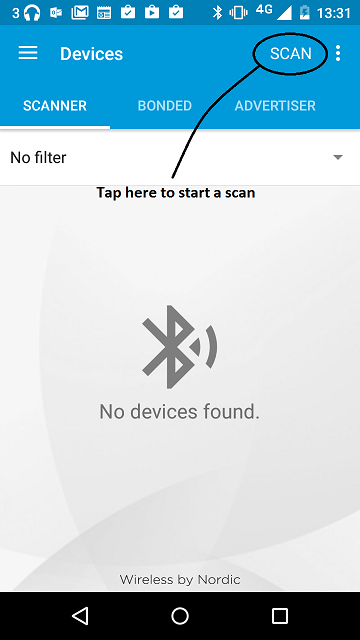
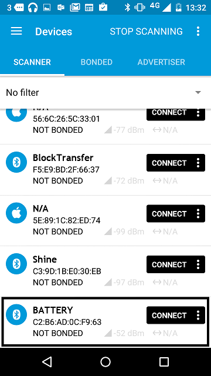

This example shows how to advertise a value of battery service data. The battery value is simulated.
The battery level is a percentage, with 100% being a fully charged battery and 0% being a fully drained battery.
The level starts at 50% and drains every second second, until it hits 10% when it jumps to 100% and continues draining.

# Running the application

## Requirements

Hardware requirements are in the [main readme](https://github.com/ARMmbed/mbed-os-example-ble/blob/master/README.md).

## Building instructions

Building instructions for all samples are in the [main readme](https://github.com/ARMmbed/mbed-os-example-ble/blob/master/README.md).

## Checking for success

**Note:** Screens captures depicted below show what is expected from this example if the scanner used is *nRF Connect for Mobile* version 4.0.5. If you encounter any difficulties consider trying another scanner or another version of nRF Connect for Mobile. Alternative scanners may require reference to their manuals.

1. Build the application and install it on your board as explained in the building instructions.
1. Open the BLE scanner on your phone.
1. Start a scan.

    

    **figure 1** How to start scan using nRF Connect for Mobile 4.0.5

1. Find your device; it should be named `BATTERY`.

    

    **figure 2** Scan results using nRF Connect for Mobile 4.0.5

1. Click on the entry to see the payload details

   
If you can see the battery level, and if its value is changing, the application is working properly.

