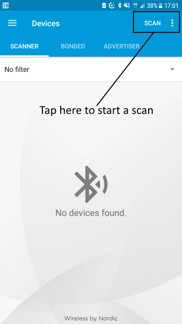
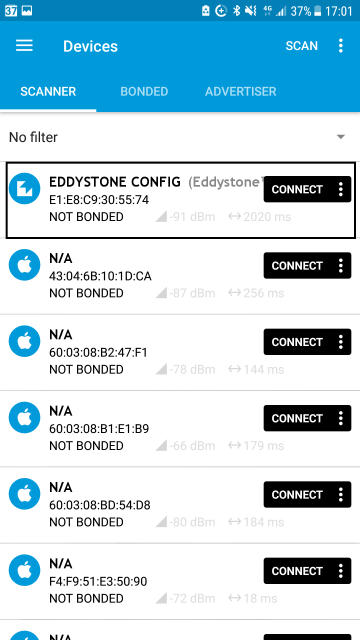
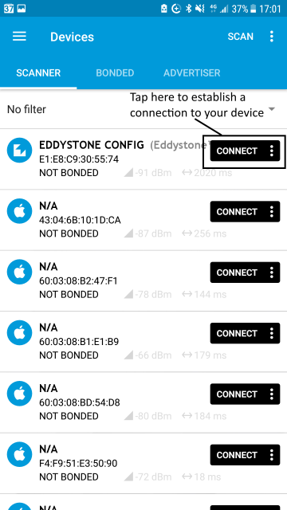
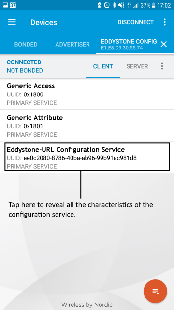
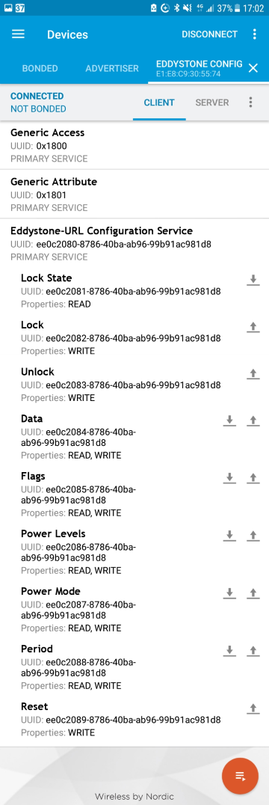
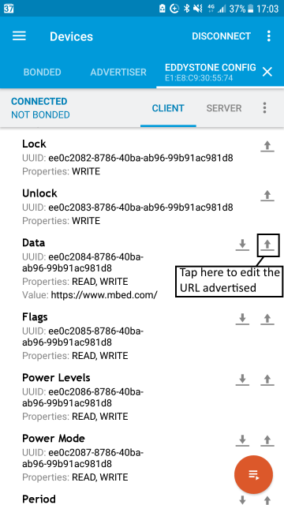
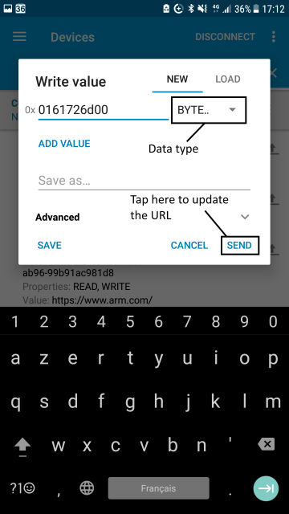
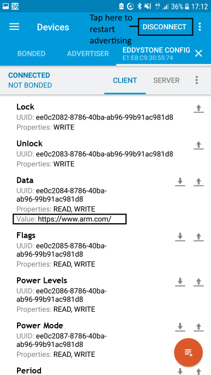
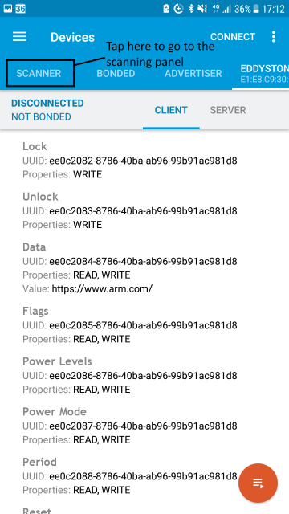
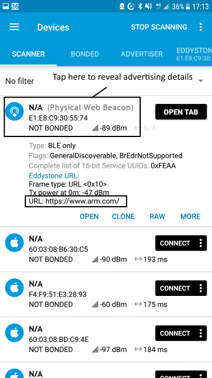

Eddystone beacons broadcast a small amount of information, like URLs, to nearby BLE devices.

The Eddystone Beacon sample application runs in two stages:

1. On startup, the Configuration Service (which allows [modification of the beacon](https://github.com/google/eddystone/blob/master/eddystone-url/docs/config-service-spec.md)) runs for a user-defined period (default - 30 seconds).

1. When the Configuration Service period ends, the Eddystone Service broadcasts advertisement packets.

# Running the application

## Requirements

The sample application can be seen on any BLE scanner on a smartphone. If you don't have a scanner on your phone, please install :

- [nRF Master Control Panel](https://play.google.com/store/apps/details?id=no.nordicsemi.android.mcp) for Android.

- [LightBlue](https://itunes.apple.com/gb/app/lightblue-bluetooth-low-energy/id557428110?mt=8) for iPhone.

Hardware requirements are in the [main readme](https://github.com/ARMmbed/mbed-os-example-ble/blob/master/README.md).

## Building instructions

Building instructions for all samples are in the [main readme](https://github.com/ARMmbed/mbed-os-example-ble/blob/master/README.md).

## Setting up the beacon

By default, the beacon directs to the url ``http://mbed.org``. You can change this to your own URL in two ways:

1. Manually edit the code in ``main.cpp`` in your copy of the sample.

1. Build and run the application's default code as explained in the building instructions. When the beacon starts up, the Configuration Service runs for 30 seconds (this is the default value; you can change it in ``main.cpp``). While the Configuration Service runs, you can use a BLE scanner on your phone to edit the values the service presents.

## Checking for success

1. Build the application and install it on your board as explained in the building instructions.

1. Open the BLE scanner on your phone.

1. Start a scan.

    

    **figure 1** Start of the *nRF Connect* application version 4.8.1 on Android

1. Find your device; it should be named `EDDYSTONE CONFIG`. When the beacon starts up, the Configuration Service runs for 30 seconds.
During this time it is possible to change the URL advertised by the beacon.
It is also important to note that during these 30 seconds, your device will not advertise any URL.

    

    **figure 2** Scan results using nRF Master Control Panel 4.8.1

1. Establish a connection with your device while it is configurable.

    

    **figure 3** How to establish a connection using Master Control Panel 4.8.1

1. Discover the services and the characteristics on the device. The *Eddystone-URL Configuration Service* has the UUID `ee0c2080-8786-40ba-ab96-99b91ac981d8` and includes the *URI Data* characteristic which has the UUID `ee0c2085-8786-40ba-ab96-99b91ac981d8`.

    

    **figure 4** Minimized view of services using Master Control Panel 4.8.1

    

    **figure 5** Extended view of the *Eddystone-URL Configuration Service* using Master Control Panel 4.8.1

1. Edit the URL advertised by your beacon. You can learn more about the encoding rule [here](https://github.com/google/eddystone/blob/a52406ee6053720f78fb0c63bfc38b38e6800824/eddystone-url/README.md#eddystone-url-http-url-encoding). For this example, we can set the URL to https://www.arm.com by setting the value to `0x0161726D00`.

    

    **figure 6** How to edit characteristic value using Master Control Panel 4.8.1

    

    **figure 7** Edition of the URL using Master Control Panel 4.8.1

1. The URL is now set https://www.arm.com . It is mandatory to disconnect your phone from the beacon to let the beacon advertise the new URI.

    

    **figure 8** URL updated using Master Control Panel 4.8.1.

1. Enter the scanner mode and start a scan to see the URL advertised by the beacon.

    

    **figure 9** How to enter reenter in the scanner command panel using Master Control Panel 4.8.1.

    

    **figure 10** Eddystone beacon advertising.    

**Note:** You can use the [Eddystone Observer](https://github.com/ARMmbed/mbed-os-example-ble/tree/master/BLE_EddystoneObserver) sample instead of a phone application.

Known issues 
============

* [NRF51_DK]: Link fail if the project is exported with the exporter `make_gcc_arm `. The workaround is to define the compilation profile when the project is exported: `mbed export -i make_gcc_arm -m nRF51_DK --profile develop`.

