# BLE Service Example

This application shows how to add a new service and allow clients to interact with it.
This application transmits a heart rate value using the [Bluetooth SIG Heart Rate Profile](https://developer.bluetooth.org/TechnologyOverview/Pages/HRP.aspx).
The heart rate value is simulated by the application itself, not by a sensor, so that you don't have to get a sensor just to run the example.
The demo will advertise connectable advertising. Upon connection the client will be able to subscribe to heart rate value updates.

# Running the application

## Requirements

Hardware requirements are in the [main readme](https://github.com/ARMmbed/mbed-os-example-ble/blob/master/README.md).

## Building instructions

Building instructions for all samples are in the [main readme](https://github.com/ARMmbed/mbed-os-example-ble/blob/master/README.md).

## Checking for success

**Note:** Screens captures depicted below show what is expected from this example if the scanner used is *ST BLE Profile* version 2.0.0 or *nRF Master Control Panel* version 4.0.5. If you encounter any difficulties consider trying another scanner or another version of nRF Master Control Panel. Alternative scanners may require reference to their manuals.

1. Build the application and install it on your board as explained in the building instructions.
1. Open the BLE scanner on your phone.
1. Start a scan.

    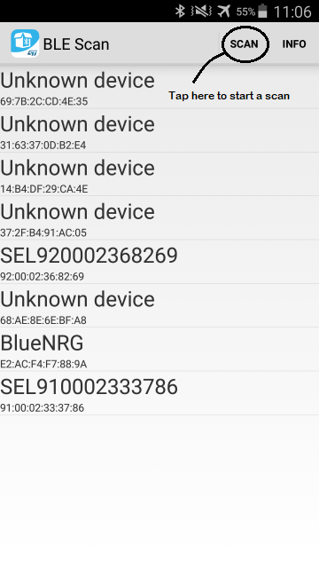

    **figure 1.a** How to start scan using ST BLE Profile 2.0.0

    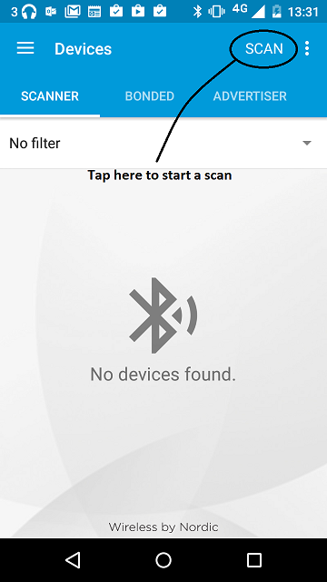

    **figure 1.b** How to start scan using nRF Master Control Panel 4.0.5

1. Find your device; it should be named `HRM`.

    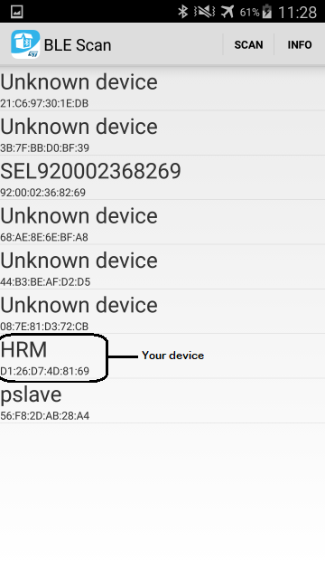

    **figure 2.a** Scan results using ST BLE Profile 2.0.0

    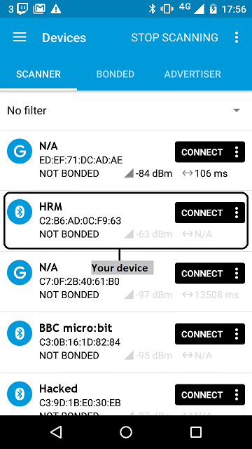

    **figure 2.b** Scan results using nRF Master Control Panel 4.0.5

1. Establish a connection with your device.

    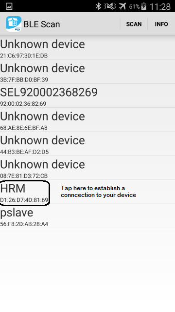

    **figure 3.a**  How to establish a connection using ST BLE Profile 2.0.0

    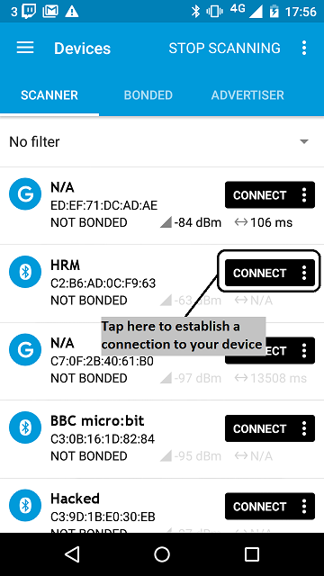

    **figure 3.b**  How to establish a connection using Master Control Panel 4.0.5

1. Discover the services and the characteristics on the device. The *Heart Rate* service has the UUID `0x180D` and includes the *Heart Rate Measurement* characteristic which has the UUID `0x2A37`.

    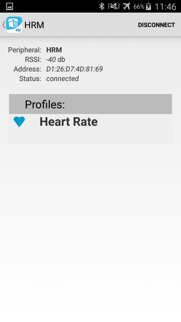

    **figure 4.a** Representation of the Heart Rate service using ST BLE Profile 2.0.0

    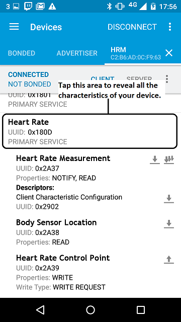

    **figure 4.b** Representation of the Heart Rate service using Master Control Panel 4.0.5

1. Register for the notifications sent by the *Heart Rate Measurement* characteristic.

    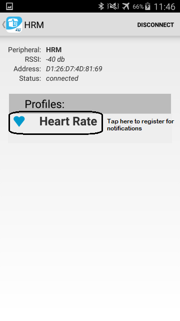

    **figure 5.a** How to register to notifications using ST BLE Profile 2.0.0

    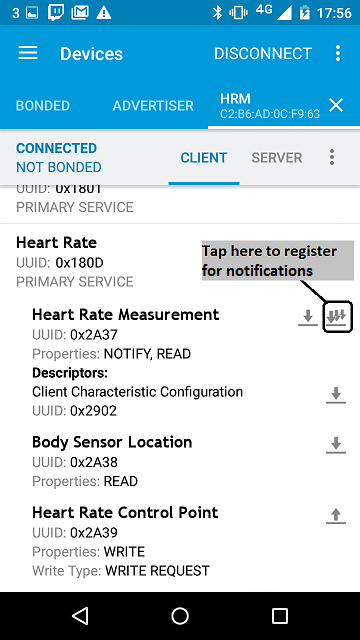

    **figure 5.b** How to register to notifications using Master Control Panel 4.0.5

1. You should see the heart rate value change every half second. For ST BLE Profile, it begins at 60, goes up to 100 (in steps of 1), resets to 60 and so on.

    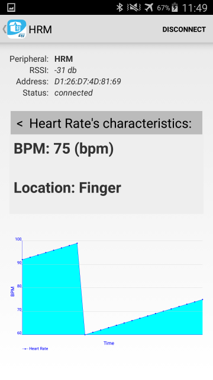

    **figure 6.a** Notifications view using ST BLE Profile 2.0.0

    For Master Control Panel, it begins at 100, goes up to 175 (in steps of 1), resets to 100 and so on.

    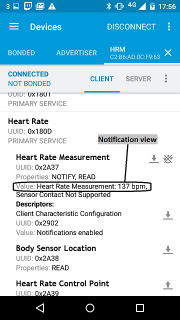

    **figure 6.b** Notifications view using Master Control Panel 4.0.5
