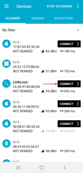
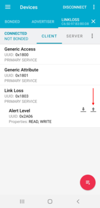
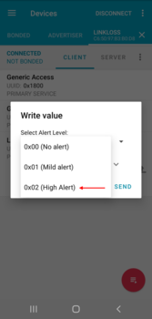
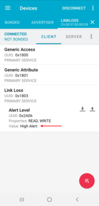

# Experimental Services
This application demonstrates a couple of the [Experimental BLE Services](https://github.com/ARMmbed/mbed-os-experimental-ble-services).

## Link Loss Service 
The application sends an alert message over a serial terminal once the connection to the client is lost without prior warning.
The client sets the alert message string by writing a valid byte to the alert characteristic inside a Link Loss Service (LLS):

* 0x00 ("No Alert")
* 0x01 ("Mild Alert") 
* 0x02 ("High Alert")

The alert ends after a user-defined timeout (= 1 minute).

### Usage

#### Hardware Requirements
Please refer to the main [README](https://github.com/ARMmbed/mbed-os-example-ble/blob/master/README.md).

#### Build Instructions
Please refer to the main [README](https://github.com/ARMmbed/mbed-os-example-ble/blob/master/README.md).

#### Demonstration
**Note:** The steps given below demonstrate the application using an Android smartphone running nRF Connect 4.24.3. 
The illustrations will be different for other clients.         
*  Build the application and flash the board
*  Open a serial terminal on your host to receive serial prints from the application:
  `mbed term -b 115200`
*  Open nRF Connect, locate your device and press connect (Fig. 1)

**Fig. 1. Connecting to the device**

*  Press the upward pointing arrow to to interact with the alert level characteristic (Fig. 2)

**Fig. 2. Interacting with the alert level characteristic**

*  Select an appropriate alert level from the dropdown menu and press send (Fig. 3)

**Fig. 3. Writing the alert level characteristic**

*  Confirm that the value parameter was updated after the write (Fig. 4)

**Fig. 4. Reading the alert level characteristic**
  
* Go far enough away from the device so that nRF Connect disconnects in an ungraceful fashion
* The alert level should appear at your terminal, e.g. "High Alert!" 

