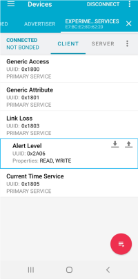

# Experimental Services
This example demonstrates the Link Loss and Current Time Services from the [Experimental BLE Services](https://github.com/ARMmbed/mbed-os-experimental-ble-services) repository.

## Overview

### Link Loss Service 
The application sends an alert message over a serial terminal once the connection to the client is lost without prior warning.
The client sets the alert level by writing a valid byte to the alert level characteristic inside the Link Loss Service (LLS):

* 0x00 ("No Alert")
* 0x01 ("Mild Alert")
* 0x02 ("High Alert")

The alert ends after a user-defined timeout (= 1 minute).

### Current Time Service
The application permits reading/writing of the device's current time. 
In the latter case, the client sets the current time by writing a stream of bytes to the current time characteristic inside the Current Time Service (CTS).
Table 1 shows the byte stream required to set the device's current time to Wed, 28 Oct 2009 11:35:37.

|  B0  |  B1  |  B2  |  B3  |  B4  |  B5  |  B6  |  B7  |  B8  |  B9  |
|:----:|:----:|:----:|:----:|:----:|:----:|:----:|:----:|:----:|:----:|
| 0xD9 | 0x07 | 0x0A | 0x13 | 0x0B | 0x23 | 0x25 | 0x03 | 0x00 | 0x00 |

**Table 1. Byte stream required to set the device's current time to Wed, 28 Oct 2009 11:35:37** 

## Usage

### Hardware Requirements
Please refer to the main [README](https://github.com/ARMmbed/mbed-os-example-ble/blob/master/README.md).

### Build Instructions
Please refer to the main [README](https://github.com/ARMmbed/mbed-os-example-ble/blob/master/README.md).

### Demonstration
**Note:** The steps given below demonstrate the application using an Android smartphone running nRF Connect 4.24.3.
The illustrations will be different for other clients.
* Build the application and flash the board
* Open a serial terminal on your host to receive serial prints from the application:
   `mbed term -b 115200`
* Open nRF Connect, locate your device and press connect (Fig. 1)

**Fig. 1 Connecting to the device**

#### Link Loss Service

* Select the Link Loss Service from the list of available services (Fig. 2)

**Fig. 2 Selecting the Link Loss Service**

* Press the upward pointing arrow to interact with the alert level characteristic (Fig. 3)

**Fig. 3. Interacting with the alert level characteristic**

* Select an appropriate alert level from the dropdown menu and press send (Fig. 4)

**Fig. 4. Writing the alert level characteristic**

* Confirm that the value parameter was updated after the write (Fig. 5)

**Fig. 5. Reading the alert level characteristic**

* Go far enough away from the device so that nRF Connect disconnects in an ungraceful fashion
* The alert level should appear at your terminal, e.g. "High Alert!"

#### Current Time Service

* Select the Current Time Service from the list of available services (Fig. 6)

* Press the upward pointing arrow to interact with the current time characteristic (Fig. 7)

* Create a new write value for the byte stream in Table 1, save and load it, and press send (Fig. 8)

* Confirm that the value parameter was updated with the correct date/time after the write (Fig. 9)

* The current time in seconds should appear at your terminal, i.e. "1256729737"
