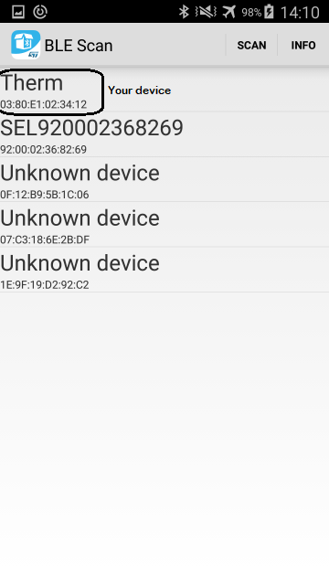
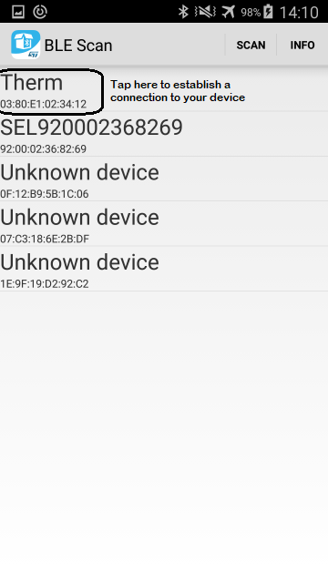
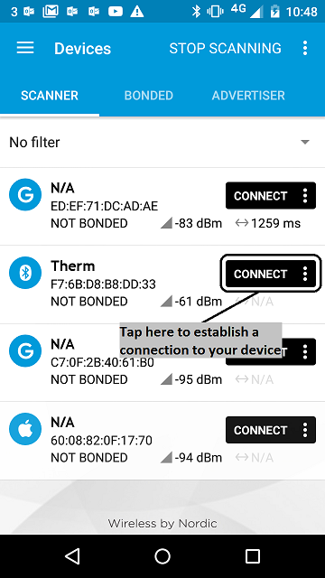
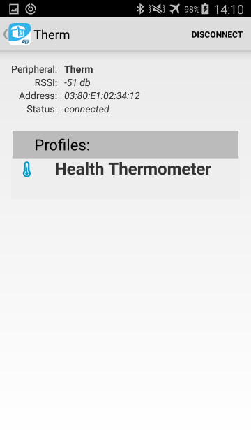
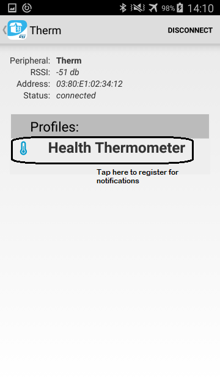
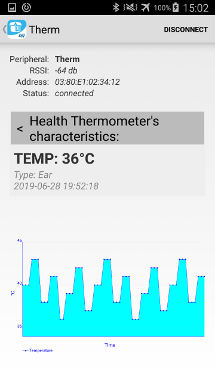

# Thermometer

This example uses the [Health Thermometer Profile](https://developer.bluetooth.org/gatt/services/Pages/ServiceViewer.aspx?u=org.bluetooth.service.health_thermometer.xml) to send thermometer information:

1. Sensor location: thermometer placement on the body. The default value in this application is the ear (``LOCATION_EAR``). The [characteristic description](https://developer.bluetooth.org/gatt/characteristics/Pages/CharacteristicViewer.aspx?u=org.bluetooth.characteristic.temperature_type.xml) shows the other possible values.

1. Temperature: the initial temperature is 39.6, and it's incremented by 0.1 every half second. It resets to 39.6 when it reaches 43.0.

For more information see:

* [Health Thermometer Service](https://developer.bluetooth.org/gatt/services/Pages/ServiceViewer.aspx?u=org.bluetooth.service.health_thermometer.xml): GATT profile details.

* [Temperature Measurement](https://developer.bluetooth.org/gatt/characteristics/Pages/CharacteristicViewer.aspx?u=org.bluetooth.characteristic.temperature_measurement.xml): GATT characteristic details for temperature measurement.

* [Temperature Type](https://developer.bluetooth.org/gatt/characteristics/Pages/CharacteristicViewer.aspx?u=org.bluetooth.characteristic.temperature_type.xml): GATT characteristic details for temperature type (sensor location).

# Running the application

## Requirements

The sample application can be seen on any BLE scanner on a smartphone. If you don't have a scanner on your phone, please install the BLE Profiles App by ST:

- [ST BLE Profile](https://play.google.com/store/apps/details?id=com.stm.bluetoothlevalidation) for Android.

Alternatively, you can install:

- [nRF Master Control Panel](https://play.google.com/store/apps/details?id=no.nordicsemi.android.mcp) for Android.

- [LightBlue](https://itunes.apple.com/gb/app/lightblue-bluetooth-low-energy/id557428110?mt=8) for iPhone.

Hardware requirements are in the [main readme](https://github.com/ARMmbed/mbed-os-example-ble/blob/master/README.md).

## Building instructions

Building instructions for all mbed OS samples are in the [main readme](https://github.com/ARMmbed/mbed-os-example-ble/blob/master/README.md).

## Checking for success

**Note:** Screens captures depicted below show what is expected from this example if the scanner used is *ST BLE Profile* version 2.0.0 or *nRF Master Control Panel* version 4.0.5. If you encounter any difficulties consider trying another scanner or another version of nRF Master Control Panel. Alternative scanners may require reference to their manuals.

1. Build the application and install it on your board as explained in the building instructions.

1. Open the BLE scanner on your phone.

1. Start a scan.

    

    **figure 1.a** How to start scan using ST BLE Profile 2.0.0

    

    **figure 1.b** How to start scan using nRF Master Control Panel 4.0.5

1. Find your device; it should be named *Therm

    

    **figure 2.a** Scan results using ST BLE Profile 2.0.0

    

    **figure 2.b** Scan results using nRF Master Control Panel 4.0.5

1. Establish a connection with your device.

    

    **figure 3.a**  How to establish a connection using ST BLE Profile 2.0.0

    

    **figure 3.b**  How to establish a connection using Master Control Panel 4.0.5

1. Discover the services and the characteristics on the device. The *Health Thermometer* service has the UUID `0x1809` and includes the *Temperature Measurement* characteristic which has the UUID `0x2A1C`.

    

    **figure 4.a** Representation of the Heart Rate service using ST BLE Profile 2.0.0

    

    **figure 4.b** Representation of the Heart Rate service using Master Control Panel 4.0.5

1. Register for the notifications sent by the *Temperature Measurement* characteristic.

    

    **figure 5.a** How to register to notifications using ST BLE Profile 2.0.0

    

    **figure 5.b** How to register to notifications using Master Control Panel 4.0.5

1. You should see the temperature value change every two seconds (ST BLE Profile) or every half second (Master Control Panel). For ST BLE Profile, it begins at 36.0, goes up to 43.0 (in steps of 1), resets to 36.0 and so on.

    

    **figure 6.a** Notifications view using ST BLE Profile 2.0.0

    For Master Control Panel, it begins at 39.6, goes up to  43.0 (in steps of 0.1), resets to 39.6 and so on.

    

    **figure 6.b** Notifications view using Master Control Panel 4.0.5

