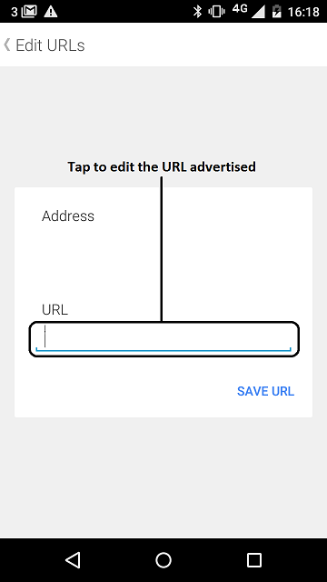

URI-Beacons are handy when there is a need to advertise a small amount of
information (usually a URL) to any nearby device. They’re really easy to set
up: the code is fully available on the mbed website, so all you’ll need to do
is tell the beacon what to broadcast.

Technical details are better presented [here](https://developer.mbed.org/teams/Bluetooth-Low-Energy/code/BLE_URIBeacon/),
which happens to be the mbed-classic equivalent of this example. Please also refer to [Google's URIBeacon project](https://github.com/google/uribeacon).

What You’ll Need
================

To get this going, you’ll need:

- To see URIBeacons get the *Physical Web* app installed on your phone:

    - [Android version](https://play.google.com/store/apps/details?id=physical_web.org.physicalweb)

    - [iOS version](https://itunes.apple.com/us/app/physical-web/id927653608?mt=8)

- One of the BLE platforms listed in the README.md of this repository, for example a
  Nordic DK board.

Build Instructions
==================

After cloning the parent repository, switch to the subfolder BLE_URIBeacon, and
execute the following:

```Shell
mbed compile -t <toolchain> -m <target>
```
Assuming that you're building for the nRF51 DK platform, available targets is
 `NRF51_DK`.

The other targets you can use are described in the main README.md for this repository.

The resulting binaries would be under `.build/<target_name>/<toolchain>/`.

Under that folder, the file called `ble-uribeacon.hex` is the one which
can be flashed to the target using mbed's DAP over USB; the parent README or the
documentation for your yotta target will explain how to choose between the available
binaries and hex files.

Checking for Success
====================


1. Build the application and install it on your board as explained in the building instructions.

1. Open the *Physical Web* application on your phone. It will start to search for nearby beacons.

    

    **figure 1** Start of the *Physical Web* application version 0.1.856 on Android

1. When the beacon starts up, the Configuration Service runs for 60 seconds.
During this time it is possible to change the URL advertised by the beacon.
It is also important to note that during these 60 seconds, your device will not advertise any URL.

    

    **figure 2** How to open the beacon configuration view using the *Physical Web* application version 0.1.856 on Android


1. Edit the URL advertised by your beacon.

    

    **figure 3** How to edit the URL advertised by your beacon using the *Physical Web* application version 0.1.856 on Android


1. Save the URL which will be advertised by your beacon.

    

    **figure 4** How to save your beacon configuration and start advertising URL using the *Physical Web* application version 0.1.856 on Android.


1. Find your device; it should advertise the URL you have set.

    

    **figure 5** Display of URL advertised by your beacon using the *Physical Web* application version 0.1.856 on Android.


**Please note that the URIBeacon spec requires the URIBeacon app to remain in
config mode for the first 60 seconds before switching to being a beacon. So if
you're using a physical-web app, you'll only see the beacon after this period;
if you're using one of the generic apps for BLE scanning, you should see a
configurable beacon being advertised for the first 60 seconds.**

You'll find [links](https://github.com/google/uribeacon/tree/uribeacon-final#contents) on Google's project page to client apps to test URIBeacon. Here's a link that should get you an [Android App](https://github.com/google/uribeacon/releases/tag/v1.2); please browse to `uribeacon-sample-release.apk`. But you should begin with the links to android apps mentioned above.
