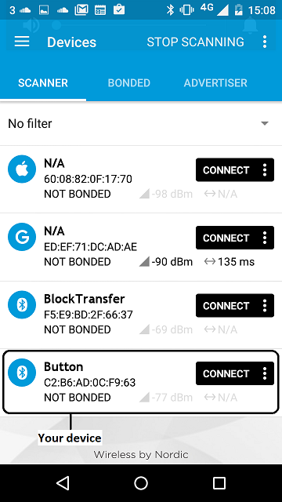
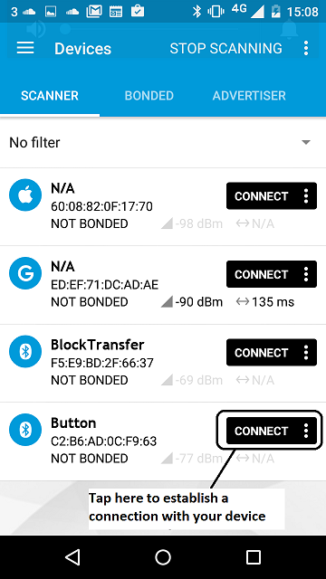
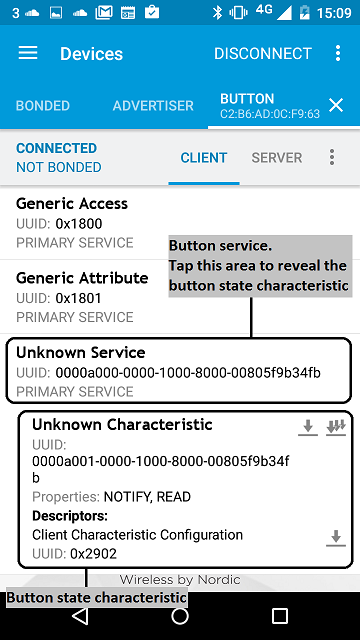
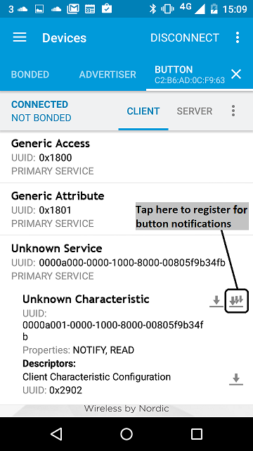
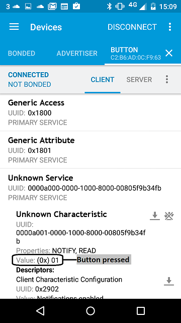
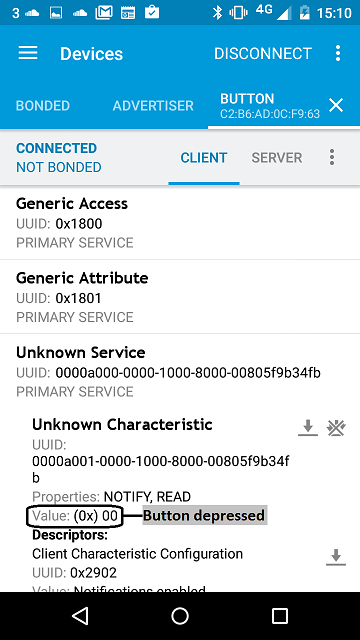

BLE_Button is a BLE service template. It handles a read-only characteristic with a simple input (boolean values). The input's source is the button on the board itself - the characteristic's value changes when the button is pressed or released.

The template covers:

1. Setting up advertising and connection modes.

1. Creating an input characteristic: read-only, boolean, with notifications.

1. Constructing a service class and adding it to the BLE stack.

1. Assigning UUIDs to the service and its characteristic.

1. Pushing notifications when the characteristic's value changes.

# Running the application

## Requirements

The sample application can be seen on any BLE scanner on a smartphone. If you don't have a scanner on your phone, please install :

- [nRF Master Control Panel](https://play.google.com/store/apps/details?id=no.nordicsemi.android.mcp) for Android.

- [LightBlue](https://itunes.apple.com/gb/app/lightblue-bluetooth-low-energy/id557428110?mt=8) for iPhone.

Hardware requirements are in the [main readme](https://github.com/ARMmbed/mbed-os-example-ble/blob/master/README.md).

### Porting this example on new boards

This example requires a board with at least a button to work. While the pin name of the button is defined for the `NRF51_DK`, `NRF52_DK`, `K64F` and `NUCLEO_F401RE`, it is not specified for other boards.

It is easy to add the button configuration for your board:
* Open the file named `mbed_app.json` at the root of this example.
* In the section `target_overides` add a new object named after your target if it doesn't exist. This object contain overridden parameters for your target.
* Override the property `ble_button_pin_name` in your target object. The value of the property should be equal to the pin name to use as a button.

As an example, this is the JSON bit which has to be added in the `target_overrides` section of `mbed_app.json` for a `NUCLEO_F411RE` board.

```json
        "NUCLEO_F411RE": {
            "ble_button_pin_name": "USER_BUTTON"
        }
```

<span> **Note:** You can get more informations about the configuration system in the [documentation](https://github.com/ARMmbed/mbed-os/blob/master/docs/config_system.md)</span>

<span> **Important:** If your target use an ST BLE shield, other parameters have to be overridden for your target. More information are available in the global [README](https://github.com/ARMmbed/mbed-os-example-ble/blob/master/README.md#targets-for-ble)</span>

## Building instructions

Building instructions for all samples are in the [main readme](https://github.com/ARMmbed/mbed-os-example-ble/blob/master/README.md).

## Checking for success

**Note:** Screens captures depicted below show what is expected from this example if the scanner used is *nRF Master Control Panel* version 4.0.5. If you encounter any difficulties consider trying another scanner or another version of nRF Master Control Panel. Alternative scanners may require reference to their manuals.

1. Build the application and install it on your board as explained in the building instructions.
1. Open the BLE scanner on your phone.
1. Start a scan.

    

    **figure 1** How to start scan using nRF Master Control Panel 4.0.5

1. Find your device; it should appear with the name `Button` in the scanner.

    

    **figure 2** Scan results using nRF Master Control Panel 4.0.5

1. Establish a connection with the device.

    

    **figure 3**  How to establish a connection using Master Control Panel 4.0.5

1. Discover the services and the characteristics on the device. The *Button service* has the UUID `0xA000` and includes the *Button state characteristic* which has the UUID `0xA001`. Depending on your scanner, non standard 16-bit UUID's can be displayed as 128-bit UUID's. If it is the case the following format will be used: `0000XXXX-0000-1000-8000-00805F9B34FB` where `XXXX` is the hexadecimal representation of the 16-bit UUID value.

    

    **figure 4** Representation of the Button service using Master Control Panel 4.0.5

1. Register for the notifications sent by the button state characteristic then the scanner will automatically receive a notification containing the new state of the button every time the state of the button changes.

    

    **figure 5** How to register to notifications using Master Control Panel 4.0.5


1. Pressing Button 1 on your board updates the state of the button and sends a notification to the scanner. The new state of the button characteristic value should be equal to 0x01.

    

    **figure 6** Notification of button pressed using Master Control Panel 4.0.5

1. Releasing Button 1 on your board updates the state of the button and sends a notification to the scanner. The new state of the button characteristic value should be equal to 0x00.

    

    **figure 7** Notification of button depressed using Master Control Panel 4.0.5
